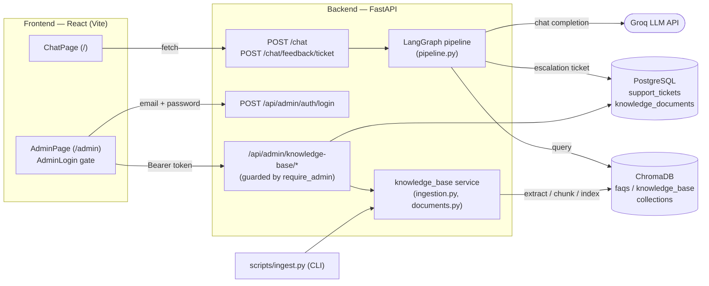
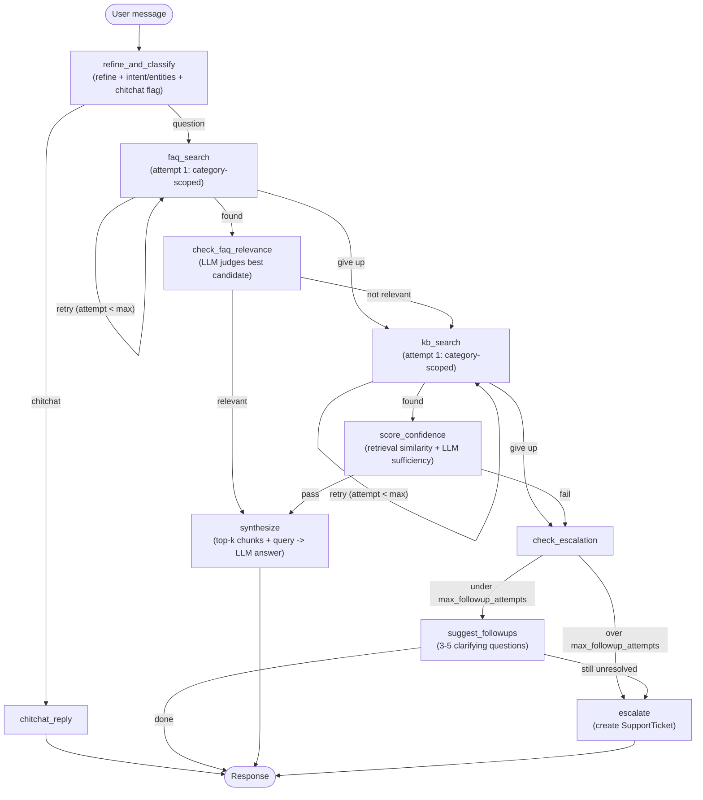
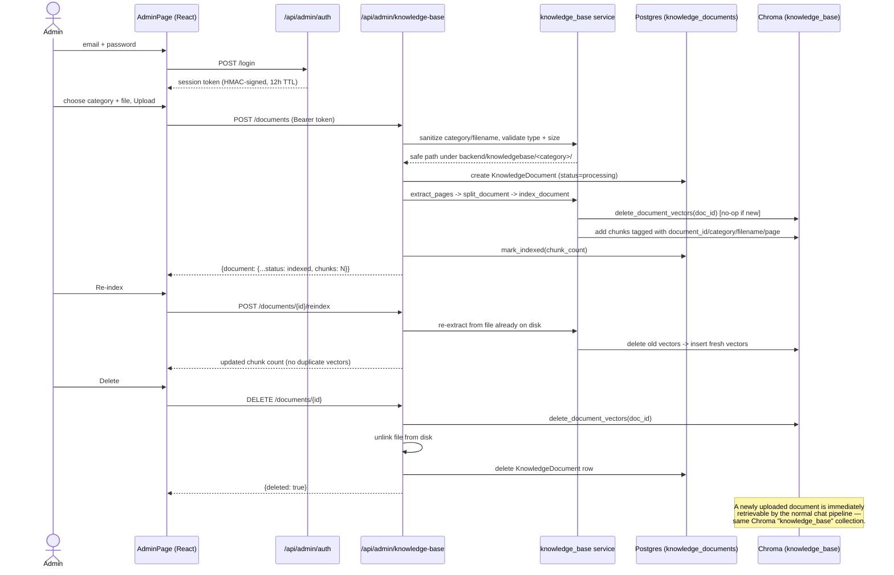

# Architecture

## 1. System overview

- **Two frontend routes**, one custom history-API router (no routing library): the chat widget and the admin dashboard, which sits behind a login screen.
- **Two ways into the knowledge base**: the admin dashboard (`/api/admin/knowledge-base`) and the CLI script — both call the *same* `app/services/knowledge_base/` code, so there is one place that turns a file into indexed Chroma chunks.
- **Groq** is the only LLM provider, called from `app/services/llm.py` at several pipeline steps (refine/classify, FAQ relevance, KB confidence, synthesis, follow-up suggestions).
- **Postgres** stores only metadata/state — `support_tickets` (escalations) and `knowledge_documents` (the admin KB registry) — never file binaries or vectors.

## 2. Chat request flow (LangGraph pipeline)

- **FAQ answers are never confidence-gated** — a relevant FAQ hit goes straight to synthesis.
- **Confidence scoring only happens for the KB layer**, and only gates KB answers, never FAQ ones.
- Each retrieval layer retries up to `MAX_LAYER_ATTEMPTS` (default 2): attempt 1 is scoped to the classified intent's category, attempt 2 reformulates the query and loosens the match threshold across all categories.
- Escalation isn't immediate — `check_escalation` counts consecutive unsuccessful turns in `chat_history` and only escalates once `max_followup_attempts` is exceeded; until then it offers follow-up questions instead.

## 3. Admin Knowledge Base management flow

- A document's `document_id` is stable across re-indexing, so `index_document` always deletes that document's previous vectors before adding new ones — repeated re-indexing never accumulates duplicates.
- All three mutating routes (upload/reindex/delete) sit behind the router-level `require_admin` dependency — a missing/invalid/expired Bearer token gets a `401` before any of this runs.

## Key files

| Concern | File |
|---|---|
| Graph wiring | `backend/app/services/graph/pipeline_graph.py` |
| Shared chat state | `backend/app/services/graph/state.py` |
| FAQ / KB retrieval | `backend/app/services/retrieval/{faq_layer,kb_layer,shared,confidence,faq_relevance}.py` |
| Escalation & follow-up | `backend/app/services/followup.py`, `backend/app/services/support.py` |
| LLM client | `backend/app/services/llm.py` (Groq) |
| Chroma client | `backend/app/services/vectorstore/chroma_client.py` |
| Ingestion (shared) | `backend/app/services/knowledge_base/{ingestion,documents}.py` |
| Admin auth | `backend/app/services/auth.py`, `backend/app/api/routes/admin_auth.py` |
| Admin KB API | `backend/app/api/routes/admin_knowledge_base.py` |
| DB models | `backend/app/db/models.py` (`SupportTicket`, `KnowledgeDocument`) |
| Chat UI | `frontend/src/pages/ChatPage.jsx` |
| Admin UI | `frontend/src/pages/AdminPage.jsx`, `frontend/src/components/admin/*` |
| Router | `frontend/src/App.jsx`, `frontend/src/router.js` |
